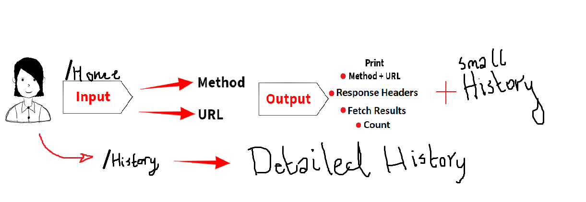

# LAB - Class 26

## Topic: Component Based UI

### Author: Darah

### Links and Resources

- [submission PR](https://github.com/Darah98/resty/pull/1)

#### Running the app

- `npm start`

#### Tests

- Only visual tests were preformed
- Jest and lint tests we skipped due to not being required for this class

#### UML

